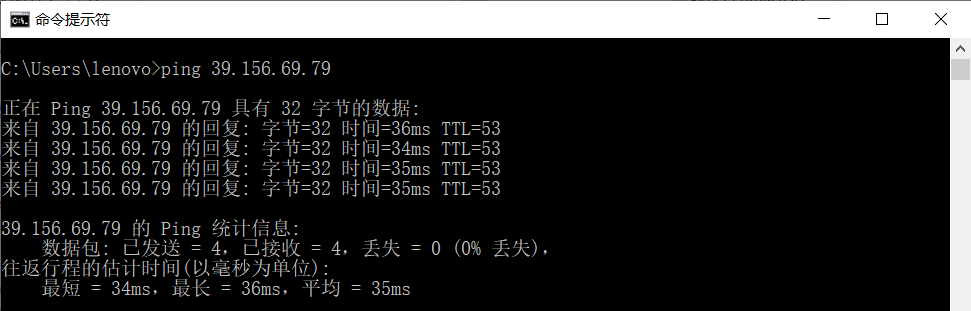
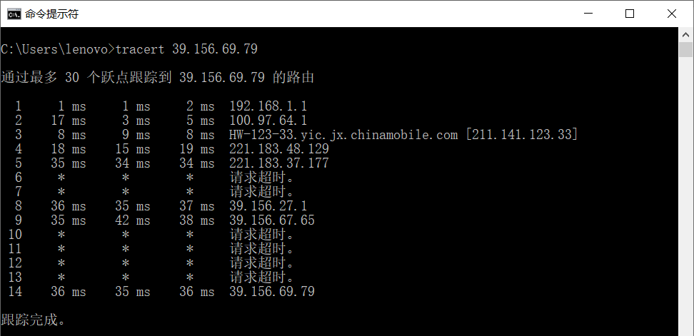

# 作业1

## 1. ping 另外一台计算机

- `ping 39.156.69.79` (baidu.com)

- 

- 1）ping 是基于 Internet 控制报文协议（ICMP）来工作的。ping 命令会发送一份 ICMP 回显请求报文给目标主机，并等待目标主机返回 ICMP 回显应答。因为ICMP协议会要求目标主机在收到消息之后，必须返回ICMP应答消息给源主机，如果源主机在一定时间内收到了目标主机的应答，则表明两台主机之间网络是可达的。
  2）除了监测是否可达以外，还可以利用应答时间和发起时间之间的差值，计算出数据包的延迟耗时。

## 2. tracert 一个服务器

- `tracert 39.156.69.79`

- 

- 1) tracert 是一个简单的网络诊断工具，其功能与 ping 类似，但获得的信息更为详细，它可以跟踪测试报文所有经过的路径，可以用于对网络进行故障排查。

  2) tracert 通过向目标发送不同 IP 生存时间（TTL）值的 ICMP 回应数据包，来确定到目标所采取的路由。具体原理如下：

  1. 从源地址发出一个 ICMP 请求回显（ICMP Echo Request）数据包到目的地址，并将 TTL 设置为1
  2. 到达路由器时，将 TTL 减1
  3. 当 TTL 变为0时，包被丢弃，路由器向源地址发回一个 ICMP 超时通知（ICMP Time Exceeded Message），内含发送 IP 包的源地址，IP 包的所有内容及路由器的IP地址
  4. 当源地址收到该 ICMP 包时，显示这一跳路由信息
  5. 重复1～5，并每次设置 TTL 加1
  6. 直至目标地址收到探测数据包，并返回 ICMP 回应答复（ICMPEcho Reply）
  7. 当源地址收到ICMP Echo Reply包时停止tracert
  8. 在未能到达路由器或未返回ICMP超时通知的情况下，相应的延时位置会以*显示

