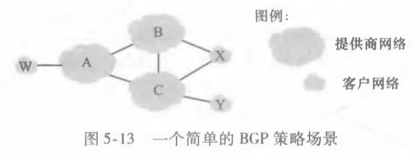
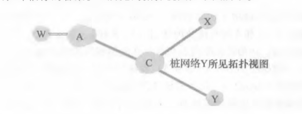
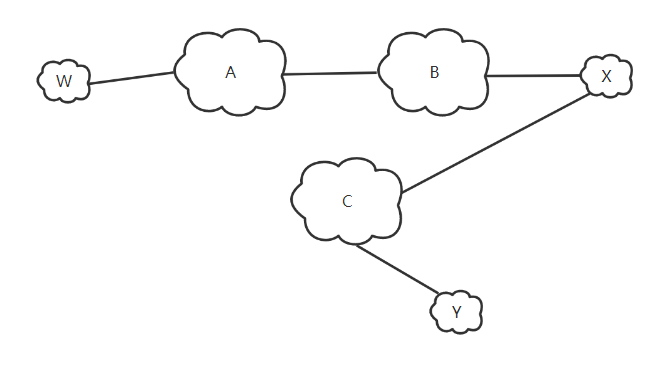
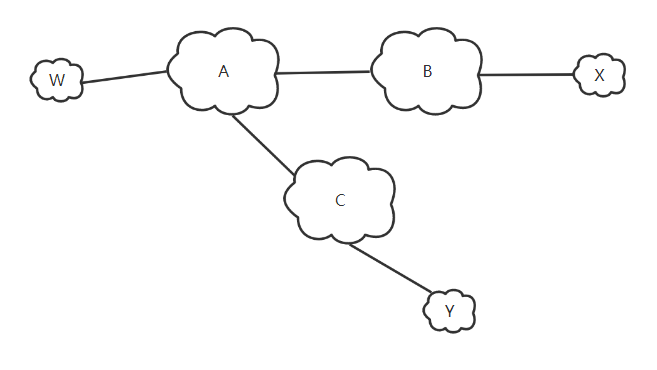

# 作业10

## 1. P17

### 题目

在图5-13中，考虑到达桩网络W、X和Y的路径信息。基于W与X处的可用信息，它们分别看到的网络拓扑是什么？评估你的答案。Y所见的拓扑视图如下图所示。

### 回答

桩网络X所见拓扑视图如下：

桩网络W所见拓扑视图如下：

## 2. P19

### 题目

在图5-13中，假定有另一个桩网络V, 它为ISP A的客户。假设B和C具有对等关系，并且A是B和C的客户。假设A希望让发向W的流量仅来自B,并且发向V的流量来自B或C。A如何向B和C通告其路由？ C收到什么样的AS路由？

### 回答

A向B和C通告的路由：

- A向B通告：AW 和 AV
- A向C通告：AV

C收到的AS路由：

BAW，BAV 和 AV

## 3. P21

### 题目

考虑在管理实体和被管设备之间发生通信的两种方式：请求响应方式和陷阱方式。从以下方面考虑这两种方式的优缺点：①开销；②当异常事件出现时通知的时间；③对于管理实体和设备之间丢失报文的健壮性。 

### 回答

1. 开销
   - 请求响应方式开销更大，陷阱方式开销更小。
   - 因为请求响应方式每次信息交换都需要请求和响应两条信息。
   - 而陷阱方式一般只需要一条信息进行通知即可。
2. 异常事件出现时通知的时间
   - 请求响应方式在异常事件出现时通知的事件一般要晚于陷阱方式。
   - 因为请求响应方式要检查异常事件的出现只能通过轮询的方式，因此当异常事件出现后，通知的响应信息到达管理服务器的时间平均为响应传输时间加上请求-响应总时间的一半。
   - 而陷阱方式会在异常事件出现时立刻发送消息通知到管理服务器，消耗时间一般只需要将消息传送到管理服务器。
3. 对于管理实体和设备之间丢失报文的健壮性
   - 请求响应方式的健壮性要优于陷阱方式。
   - 因为请求响应方式有双方的参与，若请求或响应报文丢失，管理服务器都将收不到响应，从而得知报文丢失，可以重新请求。
   - 而陷阱方式是由被管设备的网络管理代理单向传输给管理服务器的，若报文丢失，由于没有响应，双方都无从得知，故健壮性要更差。

