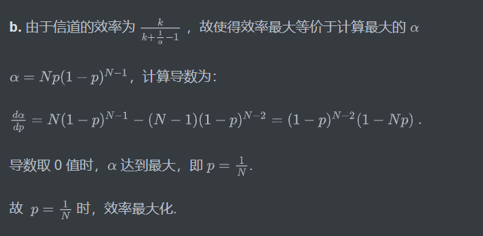
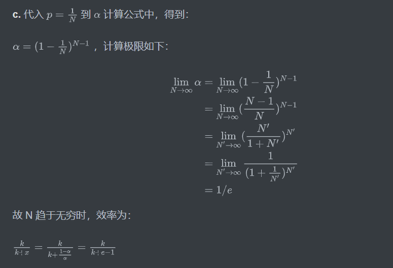

# 作业11

## 1. P7

### 题目

在这道习题中，我们探讨CRC的某些性质。对于在6. 2. 3节中给出的生成多项式G（ =1001）,回答 下列问题： 

a.为什么它能够检测数据 D 中的任何单比特差错? 

b.上述G能够检测任何奇数比特差错吗？为什么? 

### 回答

原始回答如下：

**a.** 成功发送的数据满足等式 ${D}\cdot{2}^{r} XOR R = nG$ 。

当 D 中某一比特位翻转时，收到的数据为 ${D}\cdot{2^r} XOR R + {2^i} = nG + {2^i} ({r}\le{i}\le{d+r-1}) $ ，而 显然 $G = 1001$ 无法被 $2^i$ 整除或整除 $2^i$ 。故 D 中任一比特为出现差错时，G均能检测到。

**b.** 类似 a 中所分析的，当 D 中奇数位比特位翻转时，收到的数据中除了整除部分，新增了奇数个 1 的序列部分。

而 $G = 1001$ 能够被 11 整除，而任何奇数个 1 形成的序列均不可被 11 整除，故一定也不能被 G 整除，故出现奇数个位翻转时，一定会导致除 G 之后的余数不为 0，故能检测到差错。

## 2. P20

### 题目

在这个习题中，你将对一个类似于CSMA/CD的多路访问协议的效率进行推导。在这个协议中，时间分为时隙，并且所有适配器都与时隙同步。然而，和时隙ALOHA不同的是，一个时隙的长度（以秒计）比一帧的时间（即传输一帧的时间）小得多。令S表示一个时隙的长度。假设所有帧都有恒定长度 $L=kRS$ ，其中 R 是信道的传输速率，k 是一个大整数。假定有 N 个节点.每个节点都有无穷多帧要发送。我们还假设 ${d_{prop}}\lt{S}$ ，以便所有节点在一个时隙时间结束之前能够检测到碰撞，这个协议描述如下： 

- 对于某给定的时隙，如果没有节点占有这个信道，所有节点竞争该信道；特别是每个节点以概 率 p 在该时隙传输。如果刚好有一个节点在该时隙中传输，该节点在后续的 k-1 个时隙占有信 道，并传输它的整个帧。
- 如果某节点占用了信道，所有其他节点抑制传输，直到占有信道的这个节点完成了该帧的传输 为止。一旦该节点传输完它的帧，所有节点竞争该信道。
  - 注意到此信道在两种状态之间交替：“生产性状态”（它恰好持续 k 个时隙）和“非生产性状态”（它持续随机数个时隙）。显然，该信道的效率是 k/(k+x)，其中 x 是连续的非生产性时 隙的期望值。 

a. 对于固定的 N 和 p，确定这个协议的效率。 

b. 对于固定的N，确定使该效率最大化的 p 值。

c. 使用在（b）中求岀的 p（它是 N 的函数），确定当 N 趋向无穷时的效率。

 d. 说明随着帧长度变大，该效率趋近于1。

### 回答

 

原始回答如下：

**a.** 假设 $\alpha$ 为一个节点在某一时隙成功的概率，则 $\alpha = Np(1-p)^{N-1}$ .

假设随机变量 $X$ 为一个节点第一次成功发送的时隙的序号，则：

$P(X = n) = {\alpha}(1-{\alpha})^n$ ，$X$ 呈几何分布，期望值 $E(x) = 1/{\alpha}$ .

而 $X-1$ 则代表节点连续不成功的时隙数，即非生产性状态持续的时隙数，其期望值为：

$x = E(X-1) = E(X) - 1 = \frac{1-{\alpha}}{\alpha}$ .

根据题意，信道的效率计算如下：
$$
\begin{aligned}
\frac{k}{k+x} &= \frac{k}{k+\frac{1-{\alpha}}{\alpha}}\\
&= \frac{k}{k+\frac{1-{Np(1-p)^{N-1}}}{Np(1-p)^{N-1}}}
\end{aligned}
$$

原始回答如下：

**b.** 由于信道的效率为 $\frac{k}{k+\frac{1}{\alpha}-1}$ ，故使得效率最大等价于计算最大的 $\alpha$ 

$\alpha = Np(1-p)^{N-1}$，计算导数为：

$\frac{d\alpha}{dp}=N(1-p)^{N-1}-(N-1)(1-p)^{N-2} = (1-p)^{N-2}(1-Np)$ .

导数取 0 值时，$\alpha$ 达到最大，即 $p = \frac{1}{N}$. 

故  $p = \frac{1}{N}$ 时，效率最大化.

原始回答如下：

**c.** 代入 $p = \frac{1}{N}$ 到 $\alpha$ 计算公式中，得到：

$\alpha = (1-\frac{1}{N})^{N-1}$ ，计算极限如下：
$$
\begin{aligned}
\lim\limits_{N\rightarrow\infty}\alpha&=\lim\limits_{N\rightarrow\infty}(1-\frac{1}{N})^{N-1} \\
&= \lim\limits_{N\rightarrow\infty}(\frac{N-1}{N})^{N-1} \\
&= \lim\limits_{N'\rightarrow\infty}(\frac{N'}{1+N'})^{N'} \\
&= \lim\limits_{N'\rightarrow\infty}\frac{1}{(1+\frac{1}{N'})^{N'}} \\
&= 1/e \\
\end{aligned}
$$
故 N 趋于无穷时，效率为：

$\frac{k}{k+x}=\frac{k}{k+\frac{1-{\alpha}}{\alpha}} = \frac{k}{k+e-1}$

原始回答如下：

**d.** 由于帧长度 $L = kRS$ ，R和S均不变，故帧长度变大，即 k 变大，对 c 中计算所得的效率，计算k 趋于无穷时的值如下：
$$
\begin{aligned}
\lim\limits_{k\rightarrow\infty}\frac{k}{k+e-1}&=\lim\limits_{k\rightarrow\infty}(1 + \frac{1-e}{k+e-1}) \\
&= 1 \\
\end{aligned}
$$

