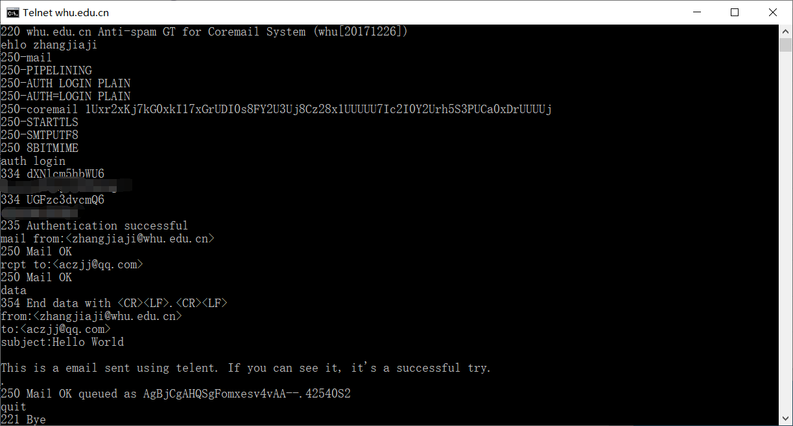
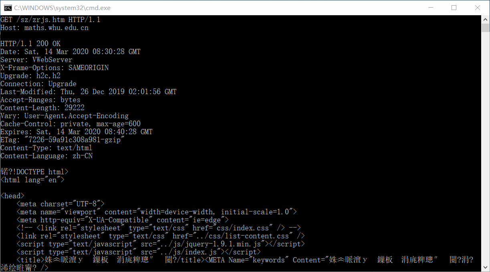

# 作业3

## 1. telnet whu.edu.cn 25

### 使用 telnet 工具与 SMTP 协议手工发送邮件

打开命令行，按如下步骤：

1. 输入 `telnet whu.edu.cn 25` 后回车

2. 连接成功后首先需要输入命令 `ehlo 用户名`，其中 `ehlo` 后的内容是发件人的用户名

3. 之后选择登录认证方式，输入命令 `auth login`

4. 之后分别输入经过 Base64 加密后的用户名和密码（使用 https://tool.chinaz.com/tools/base64.aspx 在线加密工具）

5. 指定邮件的发送人，输入命令 `mail from:<xxx@whu.edu.cn>`，此处我使用的是 `zhangjiaji@whu.edu.cn`，是我的学校邮箱

6. 指定邮件的收件人，输入命令 `rcpt to:<xxx@xxx>`，此处我使用的是 `aczjj@qq.com`，是我的qq邮箱

7. 输入命令 `data`，之后开始编写邮件内容

8. 邮件内容按照如下格式

   ```
   from:<xxx@whu.edu.cn>
   to:<xxx@xxx>
   subject:xxx
   （空行）
   邮件内容
   ```

9. 输入 . 后回车表示邮件内容输入完毕

10. 输入quit命令断开与邮件服务器的连接

11. 最后产生的结果如下：

    

    （发送后的命令行截图）

    

    （qq邮箱接收到该邮件的截图）


## 2. telnet maths.whu.edu.cn 80

### 使用 telnet 工具发送 HTTP 请求

打开命令行，按如下步骤：

1. 输入 `telnet maths.whu.edu.cn 80` 后回车

2. 连接成功后键入 `ctrl + [`，并回车

3. 输入

   ```
   GET /sz/zrjs.htm HTTP/1.1
   Host: maths.whu.edu.cn
   ```

4. 两次回车后便可以将该GET请求发送到服务器，返回武汉大学数学与统计学院官网专任教师列表的页面，结果如下：

   

   （由于html代码过多，不全部展示）


## 3. 课本第二章习题

### 3.1 P8

**题目**：参照习题P7,假定在同一服务器上某HTML文件引用了 8个非常小的对象。忽略发送时间，在下列 情况下需要多长时间：

**a.没有并行TCP连接的非持续HTTP。**

使用没有并行TCP连接的非持续HTTP，则每一个对象的请求都需要发起一次TCP连接，即需要 $2RTT_0$ 的时间，而需要请求的对象一共包含HTML文件和其引用的8个小对象，故总的等待时间为：

$t=2RTT_0 + RTT_1 + RTT_2 + ... + RTT_n + 2RTT_0 \times 8 = 18RTT_0 + RTT_1 + RTT_2 + ... + RTT_n$

**b.配置有5个并行连接的非持续HTTP。**

使用有5个并行连接的非持续HTTP，则首先进行HTML文件对象的请求和接受，之后再进行其他8个小对象的并行请求，由于有5个并行连接，故需要进行两次，则需要的时间为：

$t = 2RTT_0 + RTT_1 + RTT_2 + ... + RTT_n + 2 \times (2RTT_0) = 6RTT_0 + RTT_1 + RTT_2 +  ... + RTT_n$

**c.持续 HTTP。**

使用持续HTTP，则先进行HTML文件的请求，之后连接保持，其他对象的请求只需要一次 $RTT_0$ 的时间，故需要的时间为：

$t = 2RTT_0 + RTT_1 + RTT_2 + ... + RTT_n + 8RTT_0 = 10RTT_0 + RTT_1 + RTT_2 + ... + RTT_n$

此外还了解到，一般HTTP的持续连接默认使用流水线，HTTP客户将一个接一个发出各个引用对象的请求，而不是在发送出一个对象后等待下一个请求。所有请求和响应都是紧挨着发送的，则所有引用的对象所需要的时间只有一个 $RTT_0$ ，故加上HTML文件所需时间，最终在**使用带流水线的持续HTTP情况下**，总的时间为：

$t = 2RTT_0 + RTT_1 + RTT_2 + ... + RTT_n + RTT_0 = 3RTT_0 + RTT_1 + RTT_2 ... + RTT_n$  

### 3.2   P9

**题目**：考虑图2-12,其中有一个机构的网络和因特网相连。假定对象的平均长度为850000比特，从这个机构网的浏览器到初始服务器的平均请求率是每秒16个请求。还假定从接入链路的因特网一侧的路由 器转发一个HTTP请求开始，到接收到其响应的平均时间是3秒（参见2.2.5节）。将总的平均响应时间建模为平均接人时延（即从因特网路由器到机构路由器的时延）和平均因特网时延之和。对于平均接入时延，使用 $\Delta/(1-\Delta\beta)$ ，式中 $\Delta$ 是跨越接入链路发送一个对象的平均时间，$\beta$ 是对象对该接入链路的平均到达率。

**a. 求出总的平均响应时间。**

根据题意，对象平均长度 $L=850000$，平均到达率 $\beta=16$，根据途中可知，接入链路的传输速率为 $R=15$Mbps，平均因特网时延即发送HTTP请求到收到响应的平均时间，为3s. 故总的平均响应时间的计算如下：
$$
\begin{aligned}
总平均响应时间 &= 平均接入时延+平均因特网时延\\
&=\frac{\Delta}{1-\Delta\beta}+3\\
&=\frac{\frac{850000}{15000000}}{1-\frac{850000}{15000000}\times16}\\
&\approx3.61
\end{aligned}
$$
即总的平均时延约等于 3.61 s

**b. 现在假定在这个机构LAN中安装了一个缓存器。假定命中率为0.4,求出总的响应时间。 **

根据2.2.5中的描述，在缓存命中的时候，由于客户和缓存连接在一个相同的高速局域网上，40%的请求将几乎立即由缓存器得到响应，时延约在 10ms 以内。而剩余60%的请求仍由初始服务器满足，即平均到达率 $\beta'=16\times0.6=9.6$.

故：
$$
\begin{aligned}总平均响应时间 &= 0.4\times0.01+0.6\times\frac{\frac{850000}{15000000}}{1-\frac{850000}{15000000}\times9.6}\\
&\approx1.88
\end{aligned}
$$
即安装缓存器之后，总的平均响应时间约为 1.88 s

