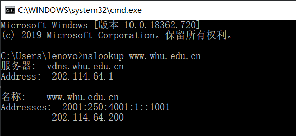

# 作业4

## 1. nslookup www.whu.edu.cn

### 查询域名解析

步骤如下：

1. 打开命令行

2. 输入 `nslookup www.whu.edu.cn`

3. 结果如下：

   

结果分析解释：

- `nslookup domain [dns-server]`这种方式使用`nslookup`时，将查询域名 `domain`的A记录，同时后面可以跟上`dns-server`以指定DNS服务器
- 输入命令后，首先出现的默认查询的本机DNS服务器名及IP地址，可以从结果看出，系统当前使用的默认DNS服务器名为 `vdns.whu.edu.cn`，其IP地址为`202.114.64.1`（该结果是在使用了武汉大学VPN的网络情况下得到的）
- 之后出现的是命令中查询的域名`www.whu.edu.cn`的记录，可以从结果看出，其IPv6地址为`2001:250:4001:1::1001`，IPv4地址为`202.114.64.200`

## 2. 课本第二章习题

### P22

1. CS分发:

   由不等式  $D_{c-s} \ge max\{NF/u_{s}, F/d_{min}\}$

   可得  $(D_{c-s})_{min} = max\{NF/u_{s}, F/d_{min}\}$

2. P2P分发:

   由不等式  $D_{P2P} \ge max\{F/u_{s}, F/d_{min}, NF/(u_{s}+\Sigma u)\}$

   可得  $(D_{P2P})_{min} \ge max\{F/u_{s}, F/d_{min}, NF/(u_{s}+\Sigma u)\}$

根据计算，得到C/S（客户-服务）分发和P2P分发在不同 $N$ 和 $u$ 的组合下所需要的最小分发时间，如下表：

| N \ u | 300kbps                 | 700kbps                 | 2Mbps                  |
| ----- | ----------------------- | ----------------------- | ---------------------- |
| 10    | C/S: 7680; P2P: 7680    | C/S: 7680; P2P: 7680    | C/S: 7680; P2P: 7680   |
| 100   | C/S: 51200; P2P: 25904  | C/S: 51200; P2P: 15616  | C/S: 51200; P2P: 7680  |
| 1000  | C/S: 512000; P2P: 47559 | C/S: 512000; P2P: 21525 | C/S: 512000; P2P: 7680 |

### P23

**题目**：考虑使用一种客户-服务器体系结构向 $N$ 个对等方分发一个 $F$ 比特的文件。假定一种某服务器能够同时向多个对等方传输的流体模型，只要组合速率不超过 $u_{s}$，则以不同的速率向每个对等方传输。 

**a. 假定 $u_{s}/N \le d_{min}$ 。定义一个具有 $NF/u_{s}$ 分发时间的分发方案。** 

方案：令服务器以上载速率 $u_{s}/N$ ，并行地同时向这 $N$ 个对等方发送文件。

服务器向每个客户端上载文件的速率为 $u_{s}/N$，总速率 $\Sigma u_{s}/N = u_{s}$. 由于 $u_{s}/N \le d_{min}$，故客户端的下载速率不低于服务器的上载速率，影响总分发时间的是服务器的上载过程。

故总分发时间为：$F / (u_{s}/N) = NF/u_{s}$. 故该方案符合题目要求。

**b. 假定 $u_{s}/N \ge d_{min}$ 。定义一个具有 $F/d_{min}$ 分发时间的分发方案。**

方案：令服务器以上载速率 $d_{min}$，并行地同时向这 $N$ 个对等方发送文件。

服务器向每个客户端上载文件的速率为 $d_{min}$，由题意得，总速率 $\Sigma d_{min} = Nd_{min} \le u_{s}$. 而由于客户端的下载速率 $d_{i} \ge d_{min}$，故下载速率大于上载速率，由上载速率决定了分发文件的总时间。

而服务器像每个对等方上载文件的速率为 $d_{min}$，故分发文件的总时间为：$F/d_{min}$. 该方案符合题目要求

**c. 得出最小分发时间通常是由 $max\{NF/u_{s}, F/d_{min}\}$ 所决定的结论。** 

假设最小分发时间为 $D_{c-s}$，则有：$D_{c-s} \ge max\{NF/u_{s}, F/d_{min}\}$

而当 $u_{s}/N \le d_{min}$ 时，$NF/u_{s} \ge F/d_{min}$，故 $D_{c-s} \ge NF/u_{s}$. 而由 a 题的回答中可知，总分发时间可以取到 $NF/u_{s}$，根据 $D_{c-s}$ 的定义，则可知 $D_{c-s} \le NF/u_{s}$. 综合得出：$D_{c-s}=NF/u_{s}$.

同理，当 $u_{s}/N \ge d_{min}$时，$NF/u_{s} \le F/d_{min}$ ， 则 $D_{c-s} \ge F/d_{min}$. 由 b 题回答得知，总分发时间可以取到 $F/d_{min}$ ，根据 $D_{c-s}$ 的定义， $D_{c-s} \le F/d_{min}$. 综合得出：$D_{c-s}=F/d_{min}$.

综上所述，可以得出最小分发时间 $D_{c-s}$ 由 $max\{NF/u_{s}, F/d_{min}\}$ 所决定的结论。

### P24

**题目**：考虑使用P2P体系结构向 $N$ 个用户分发F比特的一个文件。假定一种流体模型。为了简化起见，假定 $d_{min}$ 很大，因此对等方下载带宽不会成为瓶颈。

**a. 假定 $u_{s} \le (u_{s}+u_{1}+...+u_{N})/N$ 。定义一个具有 $F/u_{s}$ 分发时间的分发方案。** 

方案：服务器将文件划分为大小分别为 $Fu_{i}/(u_{1}+u_{2}+...+u_{N})$ 的 $N$ 块，并以速率 $r_{i}=u_{s}u_{i}/(u_{1}+u_{2}+...+u_{N})$分别向第 $i$ 个对等方上载文件（$i=1, 2, ..., N$），同时，第 $i$ 个对等方同样以 $r_{i}$ 的上载速率向其余 $N-1$ 个对等方上载自己的文件部分。

首先是文件大小，$\sum^{N}_{i=1}Fu_{i}/(u_{1}+u_{2}+...+u_{N})=F$；

其次是服务器的上载速率，$\sum^{N}_{i=1}r_{i}=u_{s}\frac{\sum^{N}_{i=1}u_{i}}{u_{1}+u_{2}+...+u_{N}} = u_{s}$，未超过服务器最大上传速率；

此外，根据题意有如下不等式成立：
$$
\begin{aligned}
u_{s} &\le (u_{s}+u_{1}+...+u_{N})/N\\
Nu_{s} &\le u_{s}+u_{1}+...+u_{N}\\
(N-1)u_{s} &\le u_{1}+u_{2}+...+u_{N}
\end{aligned}
$$
而第 $i$ 个对等方的总上载速率为： $(N-1)r_{i}=\frac{(N-1)u_{s}u_{i}}{u_{1}+u_{2}+...+u_{N}}$
根据上述不等式，可以等出：$(N-1)r_{i}=\frac{(N-1)u_{s}u_{i}}{u_{1}+u_{2}+...+u_{N}} \le u_{i}$
故对等方的上载速率也未超过最大上载速率；

最后，计算总的分发时间，由于下载速率足够大，故只用考虑上载时间，而对于任意一个对等方而言，接受大小为 $F$ 的文件，由服务器以及其余 $N-1$ 个对等方上载提供，总速率为： $r=r_{i}+r_{1}+r_{2}+...+r_{i-1}+r_{i+1}+...+r_{N}=\sum^{N}_{k=1}r_{k}=u_{s}$. 故总的分发时间为：$F/r=F/u_{s}$. 该方案满足需求。

**b. 假定 $u_{s} \le (u_{s}+u_{1}+...+u_{N})/N$ 。定义一个具有 $NF/(u_{s}+u_{1}+...+u_{N})$ 分发时间的分发方案。** 

假设 $u=u_{1}+u_{2}+...+u_{N}$，则根据题意，有 $u_{s} \le (u_{s}+u)/N$.

方案：服务器将文件共分成 $N+1$ 块，以速率 $r_{i}=u_{i}/(N-1)$ 的速率，将第 $i$ 块文件分发给第 $i$ 个对等方（$i=1, 2, ..., N$），此外，服务器以速率 $r_{N+1}=\frac{u_{s}-u/(N-1)}{N}$ 的速率，将第 $N+1$ 块文件并行发送给这 $N$ 个对等方。第 $j$ 个文件的大小为 $r_{j}\frac{NF}{u_{s}+u}$ ($j=1, 2, ..., N+1$)。同时，每个对等方以速率 $r_{i}$ 向其余 $N-1$ 个对等方上载收到的第 $i$ 块文件。

对于服务器的上载速率，由于 $u_{s} \le (u_{s}+u)/N$，则有 $u \ge (N-1)u_{s}$ . 故 $r_{N+1} \ge 0$. （当取 = 时，$NF/(u_{s}+u_{1}+...+u_{N})=F/u_{s}$，可采用a中方案）. 且服务器的总上载速率 $Nr_{N+1} + \sum^{N}_{i=1} r_{i} = u_{s}-u/(N-1)+u/(N-1) = u_{s}$.

对于对等方的上载过程，由于每个对等方需要以 $r_{i}$ 的速率向其他 $N-1$ 个对等方上载，则使用的上载总速率为：$(N-1)r_{i} = u_{i}$. 

计算总的分发时间：考虑第 $i$ 个对等方，其他节点向其上载分发的总速率为
$$
\begin{aligned}
r_{i} + r_{N+1} +\sum^{N}_{j=1, j \ne i}r_{i} &= \frac{u}{N-1} + \frac{u_{s}-\frac{u}{N-1}}{N}\\
&=\frac{Nu + (N-1)u_{s} - u}{N(N-1)}\\
&=\frac{u_{s}+u}{N}
\end{aligned}
$$
此外，对于文件大小： $\sum^{N+1}_{j=1} r_{j}\frac{NF}{u_{s}+u} = \frac{NF}{u_{s}+u} \times \frac{u_{s}+u}{N} = F$. 

故方案合理且总分发时间为：$F/(\frac{u_{s}+u}{N})=NF/(u_{s}+u)=NF/(u_{s}+u_{1}+...+u_{N})$. 该方案满足题目要求。

**c. 得出最小分发时间通常是由 $max\{F/u_{s}, NF/(u_{s}+u_{1}+...+u_{N})\}$ 所决定的结论。** 

假设最小分发时间为 $D_{P2P}$，由于 $d_{min}$ 很大，故 $F/d_{min}$ 很小，则有：$D_{P2P} \ge max\{F/u_{s}, F/d_{min}, NF/(u_{s}+u_{1}+...+u_{N})\} = max\{F/u_{s}, NF/(u_{s}+u_{1}+...+u_{N})\}$

而当 $u_{s} \le (u_{s}+u_{1}+...+u_{N})/N$ 时，$F/u_{s} \ge NF/(u_{s}+u_{1}+...+u_{N})$，故 $D_{P2P} \ge F/u_{s}$. 而由 a 题的回答中可知，总分发时间可以取到 $F/u_{s}$，根据 $D_{P2P}$ 的定义，则可知 $D_{P2P} \le NF/u_{s}$. 综合得出：$D_{P2P}=F/u_{s}$.

同理，当 $u_{s} \ge (u_{s}+u_{1}+...+u_{N})/N$时，$F/u_{s} \le NF/(u_{s}+u_{1}+...+u_{N})$， 则 $D_{P2P} \ge NF/(u_{s}+u_{1}+...+u_{N})$.  由 b 题回答得知，总分发时间可以取到 $NF/(u_{s}+u_{1}+...+u_{N})$ ，根据 $D_{P2P}$ 的定义， $D_{P2P} \le NF/(u_{s}+u_{1}+...+u_{N})$. 综合得出：$D_{P2P}=NF/(u_{s}+u_{1}+...+u_{N})$.

综上所述，可以得出最小分发时间 $D_{P2P}$ 由 $max\{F/u_{s}, NF/(u_{s}+u_{1}+...+u_{N})\}$ 所决定的结论。

