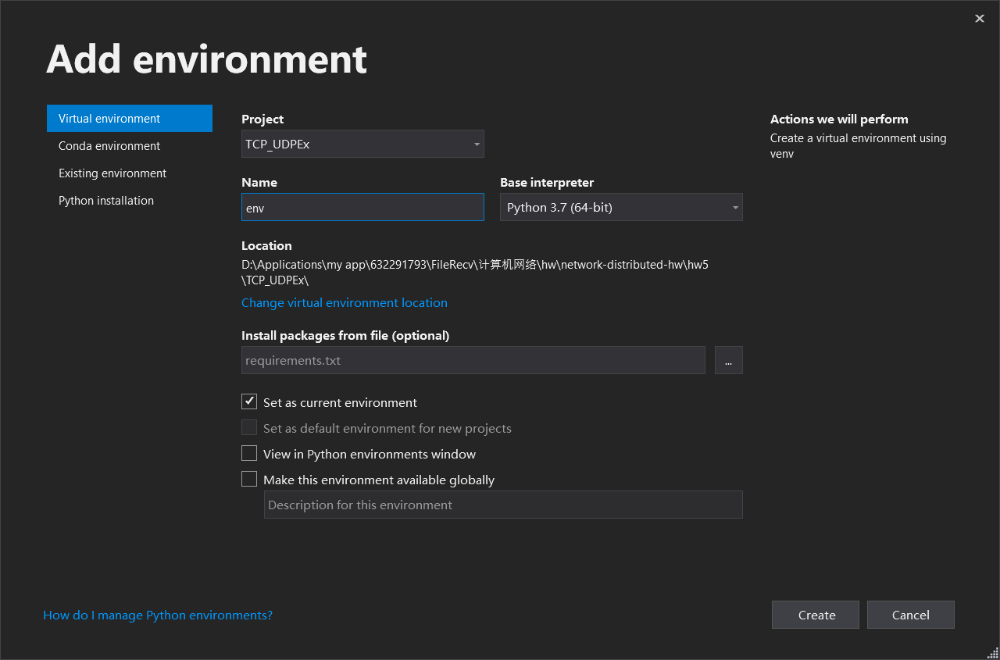
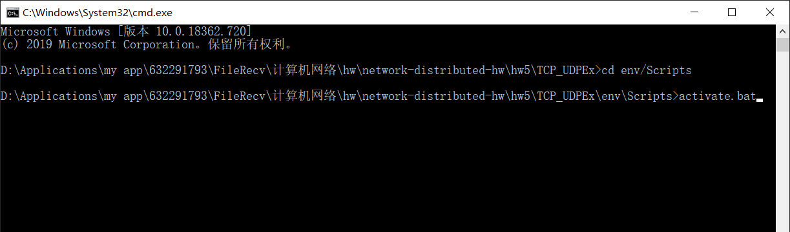
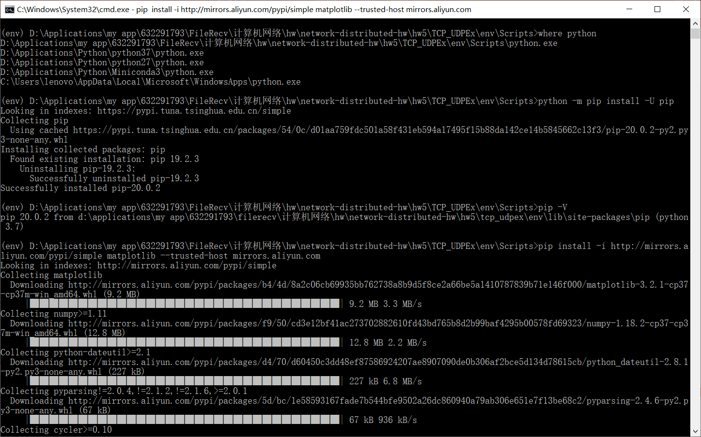
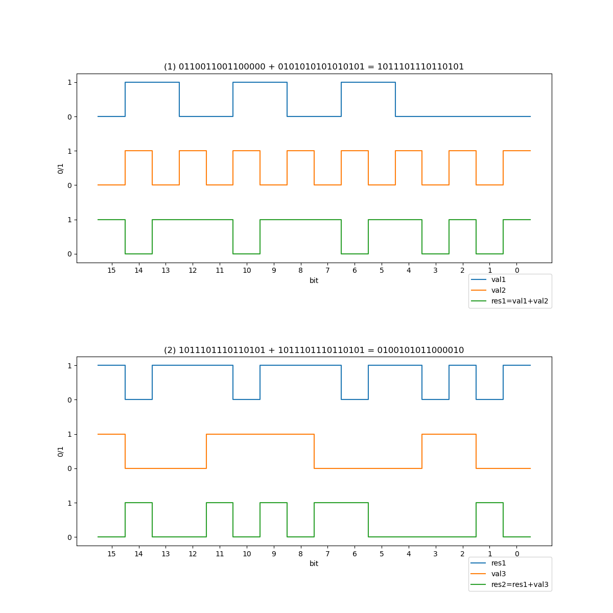

# 作业5

## 1. UDP 16位校验和 python 程序实现，并用程序验证课本 3.2.2 节的计算

### 1.1 环境搭建

- 开发工具：VIsual Studio 2019 Community
- 安装 Python 工作负载
- 新建 Python Application 项目

虚拟环境配置及 `matplotlib` 包安装：

1. 右击 Python Environments 选择 Add Environment 或 Tools -> Python -> Python Environments 进入 Python 环境窗口选择 Add Environment，打开新建环境窗口

2. 选择 Virtual environment 界面，设置各选项值（直接使用默认），点击 Create

   

3. 环境创建好后，进入项目目录，可以发现新增了一个 env 目录（目录名为新建环境时的环境名）。打开命令行，输入以下命令（# 后是注释）

```powershell
cd env/Scripts
activate.bat # 激活虚拟环境
where python # 查找 python 解释器，有多个则显示多行路径，第一行是当前使用的 python 解释器路径
python -m pip install -U pip # 更新 pip 包管理器
pip -V # 查看 pip 版本及位置
# 用 aliyun 镜像源安装 matplotlib
pip install =i http://mirrors.aliyun.com/pypi/simple matplotlib --trusted-host mirrors.aliyun.com
```

​	

​	

4. 之后可以用 pip 安装其他所需的库，或在 Visual Studio 中也可以用包管理进行安装。编写完代码后，在 Visual Studio 中右击当前使用的环境，点击 `Generate requirements.txt` 生成虚拟环境所使用的包列表文件（之后进行代码移植的时候 Visual Studio 可以根据文件将依赖的库装好，或使用 `pip install -r requirements.txt` 也可以进行批量安装）

   生成的 requirements.txt 内容如下：

```
cycler
kiwisolver
matplotlib
numpy
Package
pip
pyparsing
python-dateutil
setuptools
six
```

### 1.2 代码编写

计算校验和的过程是二进制反码求和的过程，回卷可以放到求和之后一步进行，即使用32位寄存器进行求和，最后再将32位和的高16位加到低16位上（若又产生进位则再加一遍），保留低16位输出即可。

求和时可以先求和再取反（反码），或取反后再求和（用反码求和），二者是等价的。

项目目录为 TCP_UDPEx ，代码文件共三份：

`udp_chksum.py`: 放置计算校验和的函数

`square_wave.py`: 放置产生方波数据的函数

`udp_chksum_plot.py`: 进行绘图，运行时运行该文件即可

### 1.3 执行结果



（横坐标表示 bit 的序号，从左到右为第15位-第0位，纵坐标为 bit 值；第一个图是前两个值的求和过程，第二图是上一步的求和结果和第三个值的求和过程）


## 2. 课本第三章习题

### P15

**题目**：考虑显示在图3-17中的网络跨越国家的例子。窗口长度设置成多少时，才能使该信道的利用率超过90%?假设分组的长度为1500字节（包括首部字段和数据）。 

根据题意，$L=15 \times 8 bit$ ，假设窗口长度为 $N$

则传输时间 $t_{trans}=\frac{L}{R}=\frac{1500 \times 8 bit/pkt}{10^9 bit/s}=12 us/pkt$

信道的利用率 $U_{sender}=\frac{NL/R}{RTT+L/R}>90\%$

在这个例子中 $RTT=30ms$

故 $N>\frac{0.9 \times (30+0.012)}{0.012}\approx2251$

所以窗口长度需设置为 2251 及以上，才能使信道的利用率超过 90%


### P23

**题目**：考虑GBN协议和SR协议。假设序号空间的长度为 $k$ 那么为了避免出现图3-27中的问题，对于这两种协议中的每一种，允许的发送方窗口最大为多少？ 

假设窗口大小为 $N$ ，当前接收方窗口的第一个预期序号为 $a$ ，即接收方窗口的序号为 $a, a+1, \dots, a+N-1$ .

为分析方便，范围表示直接使用递增序号。

1) 对于 GBN 协议：由于接收方窗口序号范围为 $[a, a+N-1]$ ，即接收方接收到的最新的包序号为 $a-1$， 则发送方窗口最小的序号（base端）的取值范围为 $[a-N, a]$ 。取 $a-N$ 时表示窗口最后一个序号为 $a-1$ ，此时还未收到 ACK $a-N+1$ ；取 $a$ 表示窗口第一个序号为 $a$ ，刚接收完 ACK $a-1$ ，序号为 $a$ 的包还未到达接收方。

根据题意，要避免出现接收方将旧版本的包作为新版本进行接收的情况。而发送方的旧版本的包序号范围为 $[a-N, a-1] \and \empty$ ，即发送方当前窗口中位于接收方需要接收的序号为 $a$ 的包前的包。故可能没有旧版本的包，或序号在 $a-N$ 到 $a-1$ 之间。

由于 GBN 协议的特性，需要使得旧版本的包中不含接收方当前预期的序号 $a$ ，即 $(a-1)-(a-N)+1<k$

故：$N < k$

2) 对于 SR 协议：同 GBN 协议的分析过程，接收方窗口序号范围为 $[a, a+N-1]$，发送方窗口内旧版本包的序号范围为 $[a-N, a-1] \and \empty$ .

根据 SR 协议的特性，只要旧版本包的序号在接收方窗口范围内就会被接收，故要使得 $[a-N, a-1]$ 与 $[a, a+N-1]$ 间对应于包的序号不重复，即使得这两个区间覆盖的范围长度在序号空间长度 $k$ 之内。即 $(a+N-1)-(a-N)+1 <= k$ （前一区间上界 $a-1$ 与后一区间下界 $a$ 连续）

故： $N <= k/2$

