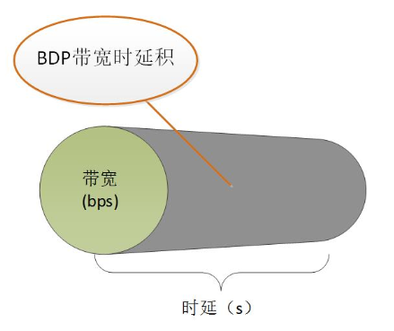
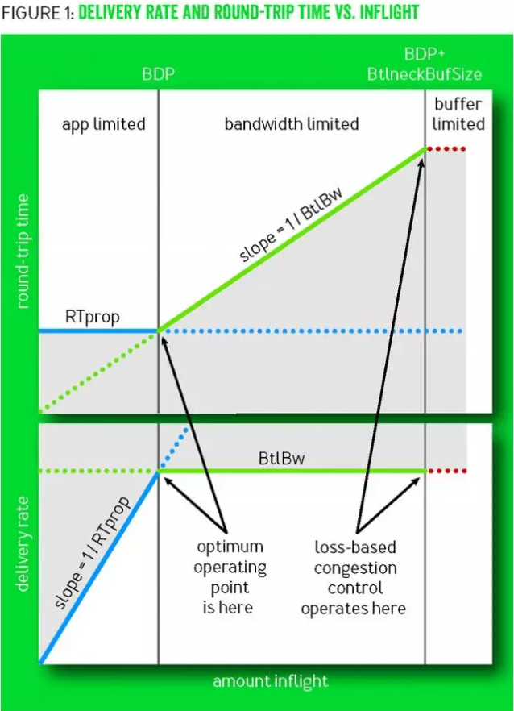
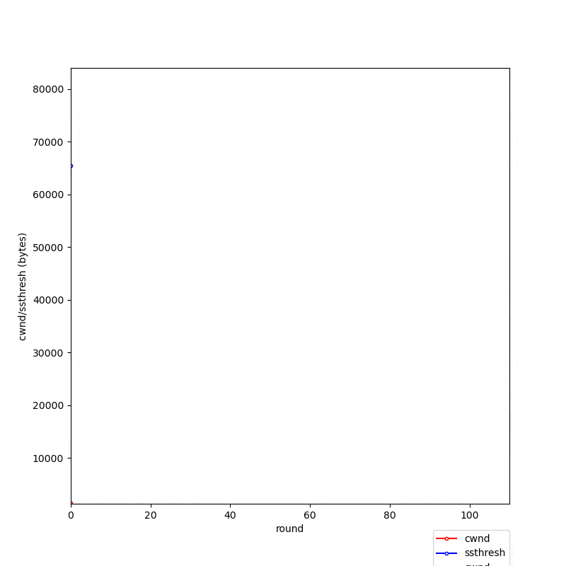

# 作业6——TCP拥塞控制演示

## 1. 简化模型

### 1.1 假设

#### 1.1.1 基础假设

1. 考虑单个发送端和接收端，网络模型简化为两端的主机及中间的瓶颈路由器

2. 对链路的分析借鉴 BBR 算法，将链路看作一段管道

   

3. 瓶颈链路带宽假设 $btlbw = 100Mbps$ ，单向最小时延为$RTprop = 40ms$ ，带宽时延积 $BDP = btlbw \times RTprop = {5}\times{10}^{5} B \approx 488 KB$，收到 ACK 前，发送端最多可以发送 $2BDP$ 的数据，多于 $2BDP$ 时，多余的数据进入瓶颈路由器的缓存队列，超出缓存队列则发生丢包。瓶颈路由器的缓存队列大小 $btl\_bufsize = 32KB$

   

4. 最大报文段长度 $MSS = 1460 B$ ，发送端每个报文段长度均为 1 MSS

5. 接收端窗口足够大，发送端每次发送尽可能多的数据，即接近拥塞窗口大小 cwnd（实际发送 MSS 的整数倍）

6. RTT 时间为发送一批数据到收到这批数据的 ACK 间的时间

7. 节点处理时间忽略不计，$RTT = 2 \times RTprop$

8. 当发送数据量超出 $2BDP$ 时，开始使用缓存队列，相当于拉长了链路“管道”，时延上升，导致 RTT 上升

9. 每一轮 Round Trip 只考虑发送方发送、接收方接收返回 ACK、发送端收到 ACK 共三个过程

10. 接收方收到的包以及发送方收到的 ACK 都以同一小概率产生错误。

    接收方正确收到包时，返回新的 ACK ，收到错误的包时，除正确的包以外的包返回重复的 ACK，重复 ACK 确认的包同最后的新 ACK 确认的包。

    发送方收到 ACK 时，首先根据采样 RTT 判断是否超时以及更新超时时间。若超时则在更新完内部状态后开始新的一轮，否则收到新的 ACK 和重复的 ACK 时，按规则正常运作，更新内部状态。新的 ACK 中有受损时，若其为新 ACK 序列的中间部分，则发生超时事件，更新状态并开始新的一轮；若其为末尾 ACK 且有重复 ACK，则从重复 ACK 中取出一个作为新 ACK；否则同样产生超时并开始新的一轮。

#### 1.1.2 概率性假设

1. 接收方收到的包和发送方收到的ACK均以极小的概率发生损坏，目前设置为 0.1%
2. “管道容量” BDP 在每一轮并不一定全部可用（其他主机的流量），分析时针对该主机采用可用 BDP 辅助分析，该数值从正态分布上采样，范围在 0 - 1 BDP 之间变动（3 sigma 范围，限制一定大于等于0）
3. 当某一轮检测到需要使用缓存队列，且可用 BDP 不足 1% 时，假设缓存队列并不一定为空（其他主机使用），实际可用大小从正态分布上采样，范围在 0 - 1 btl_bufsize 间变动（3 sigma 范围，限制一定大于等于0）
4. 计算 RTT 时间时，若不需要使用缓存队列，则理论值为 RTprop，否则则按管道延长的方式计算新值。理论值计算完毕后，实际使用的 RTT 值从正态分布中采样，范围在 0.9 - 1.2 RTT 间变动（3 sigma 范围，限制一定大于 0.9RTT）

### 1.2 状态机模型

与TCP拥塞控制的 FSM 相同，采用状态机模型，定义了三个状态：慢启动 SS、拥塞避免 CA、快速恢复 FR.

#### 1.2.1 慢启动 SS

- 初始时 `cwnd = 1 MSS` ，并设置阈值 `ssthresh`
- 每个 Round Trip 将 `cwnd` 翻倍，`cwnd` 达到或超过阈值 `ssthresh` 时进入拥塞避免状态。
- 超时则将 `ssthresh = cwnd / 2` ，`cwnd = 1 MSS` ，重新慢启动
- 收到三个重复 ACK 时，将 `ssthresh = cwnd / 2`，进入快速恢复，`cwnd = ssthresh`

#### 1.2.2 拥塞避免 CA

- 每个 Round Trip 将 `cwnd` 增加 1 `MSS`
- 超时时将 `ssthresh = cwnd / 2` ，`cwnd = 1 MSS` ，重新慢启动
- 收到三个重复 ACK 时，将 `ssthresh = cwnd / 2`，进入快速恢复，`cwnd = ssthresh`

#### 1.2.3 快速恢复 FR

- 收到重复的 ACK 时，将 `cwnd` 增加 1 `MSS`，包括进入该状态时的 3 重复 ACK
- 超时时将 `ssthresh = cwnd / 2` ，`cwnd = 1 MSS` ，重新慢启动
- 新的 ACK 到达时，将 `cwnd` 降回 `ssthresh` 并进入拥塞避免


## 2. 实际处理与编码

### 2.1 cwnd 值更新策略

实现过程中，由于状态可能在一批 ACK 中变化，采用以下方式进行实际的 cwnd 值更新：

- 慢启动阶段

  每一个新的 ACK 使 cwnd 增加 1 MSS，整个 RTT 都处于慢启动时则能完成翻倍

  ```python
  if self.ccstate == CCState.SS:
  	# 处于慢启动阶段
      self.cwnd += tcp_settings.MSS       # 每一ACK加 1MSS，整个RTT翻倍
      self.dup_ack = 0
      if self.cwnd >= self.ssthresh:
          self.set_state(CCState.CA)       # 超过阈值，进入拥塞避免阶段
  ```

- 拥塞避免阶段

  每一个新的 ACK 使 cwnd 增加 MSS / cwnd * MSS，整个 RTT 都处于拥塞避免则能增加 约 1MSS

  ```python
  elif self.ccstate == CCState.CA:
      # 处于拥塞避免状态
      self.cwnd += tcp_settings.MSS * (tcp_settings.MSS / self.cwnd)      # 整个RTT后增加约 1MSS
      self.dup_ack = 0
  ```

- 快速恢复阶段，模型中对快速恢复阶段的描述即为对新 ACK 的描述，故与状态机模型中描述采用相同处理

### 2.2 代码结构

项目在目录 CongestionControl 目录下，项目共包含 4 个 python 文件：tcp_settings.py, tcp_congestion_control.py, anim_plot.py, main.py

- tcp_settings.py: 放置一些具体设置的假设值，如 MSS 的大小，初始 ssthresh 的大小
- tcp_congestion_control.py: 放置拥塞控制相关代码，采用面向对象方式编码，共包含枚举类 `CCState`，TCP 发送方类 `SimpleTCPSender`，TCP 接收方类 `SimpleTCPReceiver`，网络分发过程控制类 `SimpleNetWorking` 四个类的定义与实现
- anim_plot.py: 放置动画绘制代码
- main.py: 程序入口，运行后控制台输出过程中相关事件以及一些状态值，同时将 cwnd 和 ssthresh 的值进行记录，并以动画绘图的形式保存为 gif 图或 mp4 视频文件（文件名为 congestion_control.gif/mp4）

### 2.3 执行结果

main.py 执行后的动画绘图如下：



（图中25轮后的快速恢复后的突然上升是由于大批重复ACK导致的增加）


## 3. 参考资料

- [面试热点|浅谈TCP/IP传输层TCP BBR算法](https://mp.weixin.qq.com/s/QK2b01F4uXKhvMIx1ARncg)
- [来自Google的TCP BBR拥塞控制算法解析](https://blog.csdn.net/dog250/article/details/52830576)
- [Google's BBR拥塞控制算法模型解析](https://blog.csdn.net/dog250/article/details/52895080)
- 课本 《计算机网络：自顶向下方法》第7版 P179 TCP拥塞控制的 FSM 描述图