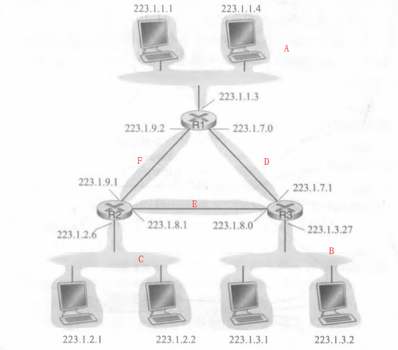

# 作业8

## 1. P12

### 题目

考虑图4・20中显示的拓扑。（在12:00以顺时针开始）标记具有主机的3个子网为网络A、B和C, 标记没有主机的子网为网络D、E和F。 

a. 为这6个子网分配网络地址，要满足下列限制：所有地址必须从 214.97.254/23 起分配；子网A 应当具有足够地址以支持250个接口；子网B应当具有足够地址以支持120个接口；子网C应当 具有足够地址以支持120个接口。当然，子网D、E和F应当支持两个接口。对于每个子网，分配采用的形式是 a.b.c.d/x 或 a.b.c.d/x ~ e.f,g.h/y。 

b. 使用你对（a）部分的答案，为这3台路由器提供转发表（使用最长前缀匹配）。 

### 回答

a. 按下表方式为6个子网分配网络地址

| 网络名称 |                IP 地址                |
| :------: | :-----------------------------------: |
|  子网A   |             214.97.254/24             |
|  子网B   |   214.97.255.0/25 ~ 214.97.255.0/30   |
|  子网C   | 214.97.255.128/25 ~ 214.97.255.129/31 |
|  子网D   |            214.97.255.0/31            |
|  子网E   |            214.97.255.2/31            |
|  子网F   |           214.97.255.128/31           |

b. 以子网标号作为路由器链路接口标号

R1:

| 前缀匹配                           | 接口 |
| :--------------------------------- | :--- |
| 11010110 01100001 11111110         | A    |
| 11010110 01100001 11111111 0000000 | D    |
| 11010110 01100001 11111111 1000000 | F    |

R2:

| 前缀匹配                           | 接口 |
| :--------------------------------- | :--- |
| 11010110 01100001 11111111 1       | C    |
| 11010110 01100001 11111111 0000001 | E    |
| 11010110 01100001 11111111 1000000 | F    |

R3:

| 前缀匹配                           | 接口 |
| :--------------------------------- | :--- |
| 11010110 01100001 11111111 0       | B    |
| 11010110 01100001 11111111 0000001 | E    |
| 11010110 01100001 11111111 0000000 | D    |

## 2. P14

### 题目

考虑向具有700字节MTU的一条链路发送一个2400字节的数据报。假定初始数据报标有标识号 422。将会生成多少个分片？在生成相关分片的数据报中各个字段的值是多少?

### 回答

数据报长度为 2400 B，则传输的数据段长度为 2400 - 20 = 2380 B；

而 MTU = 700 B，则对于数据段有效载荷为 700 - 20 = 680 B；

$\lceil{\frac{2380}{680}}\rceil=4$，最后一个数据报的载荷大小为 $2380-680*3=340$；

故共分为 4 个分片，最后一个数据报的长度为 360 B；

字段值情况为：

分片1: flag=1, fragment offset=0

分片2: flag=1, fragment offset=85

分片3: flag=1, fragment offset=170

分片4: flag=0, fragment offset=255

## 3. P19

### 题目

考虑显示在图4-30中的SDN OpenFlow网络。假定对于到达s2的数据报的期望转发行为如下： 

- 来自主机 h5 或 h6 并且发往主机 h1 或 h2 的任何数据报应当通过输出端口 2 转发到输入端口 1 。
- 来自主机 h1 或 h2 并且发往主机 h5 或 h6 的任何数据报应当通过输出端口 1 转发到输入端口 2 。
- 任何在端口 1 或 2 到达并且发往主机 h3 或 h4 的数据报应当传递到特定的主机。 
- 主机 h3 和 h4 应当能够向彼此发送数据报。 

详述实现这种转发行为的 s2 中的流表项。 

### 回答

s2 的流表项如下：

|                            匹配                            |    动作    |
| :--------------------------------------------------------: | :--------: |
| Ingress Port = 1 ; IP Src = 10.3.0.* ; IP Dst = 10.1.0.* ; | Forward(2) |
| Ingress Port = 2 ; IP Src = 10.1.0.* ; IP Dst = 10.3.0.* ; | Forward(1) |
|           Ingress Port = 1 ; IP Dst = 10.2.0.3 ;           | Forward(3) |
|           Ingress Port = 2 ; IP Dst = 10.2.0.3 ;           | Forward(3) |
|           Ingress Port = 1 ; IP Dst = 10.2.0.4 ;           | Forward(4) |
|           Ingress Port = 2 ; IP Dst = 10.2.0.4 ;           | Forward(4) |
|          IP Src = 10.2.0.3 ; IP Dst = 10.2.0.4 ;           | Forward(4) |
|          IP Src = 10.2.0.4 ; IP Dst = 10.2.0.3 ;           | Forward(3) |

