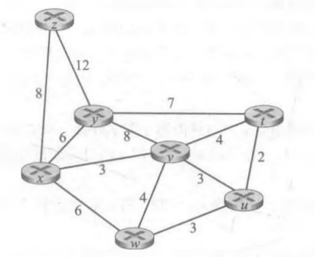

# 作业9

## 1. P3

### 题目

考虑下面的网络。对于标明的链路开销，用 Dijkstra 的最短路算法计算出从 x 到所有网络节点的最短路径。通过计算一个类似于表5-1的表，说明该算法是如何工作的。

### 回答

| 步骤 |   N'    | D(y), p(y) | D(z), p(z) | D(v), p(v) | D(w), p(w) | D(u), p(u) | D(t), p(t) |
| :--: | :-----: | :--------: | :--------: | :--------: | :--------: | :--------: | :--------: |
|  0   |    x    |    6, x    |    8, x    |    3, x    |    6, x    |  $\infin$  |  $\infin$  |
|  1   |   xv    |    6, x    |    8, x    |    3, x    |    6, x    |    6, v    |    7, v    |
|  2   |   xvy   |    6, x    |    8, x    |    3, x    |    6, x    |    6, v    |    7, v    |
|  3   |  xvyw   |    6, x    |    8, x    |    3, x    |    6, x    |    6, v    |    7, v    |
|  4   |  xvywu  |    6, x    |    8, x    |    3, x    |    6, x    |    6, v    |    7, v    |
|  5   | xvywut  |    6, x    |    8, x    |    3, x    |    6, x    |    6, v    |    7, v    |
|  6   | xvywutz |    6, x    |    8, x    |    3, x    |    6, x    |    6, v    |    7, v    |

## 2. P5

### 题目

考虑下图所示的网络，假设每个节点初始时知道到它的每个邻居的开销。考虑距离向量算法，并显示在节点 z 中的距离表表项。

### 回答

初始

| From \ to |    z     |    x     |    v     |    y     |    u     |
| :-------: | :------: | :------: | :------: | :------: | :------: |
|     z     |    0     |    2     |    6     | $\infin$ | $\infin$ |
|     v     | $\infin$ | $\infin$ | $\infin$ | $\infin$ | $\infin$ |
|     x     | $\infin$ | $\infin$ | $\infin$ | $\infin$ | $\infin$ |

发送Dz；Dv, Dx 更新

| From \ to |  z   |  x   |  v   |    y     |    u     |
| :-------: | :--: | :--: | :--: | :------: | :------: |
|     z     |  0   |  2   |  5   |    5     |    7     |
|     v     |  6   |  3   |  0   | $\infin$ |    1     |
|     x     |  2   |  0   |  3   |    3     | $\infin$ |

发送Dz；Dv, Dx 更新

| From \ to |  z   |  x   |  v   |  y   |  u   |
| :-------: | :--: | :--: | :--: | :--: | :--: |
|     z     |  0   |  2   |  5   |  5   |  6   |
|     v     |  5   |  3   |  0   |  3   |  1   |
|     x     |  2   |  0   |  3   |  3   |  4   |

发送Dz，无向量更新

| From \ to |  z   |  x   |  v   |  y   |  u   |
| :-------: | :--: | :--: | :--: | :--: | :--: |
|     z     |  0   |  2   |  5   |  5   |  6   |
|     v     |  5   |  3   |  0   |  3   |  1   |
|     x     |  2   |  0   |  3   |  3   |  4   |

## 3. P11

### 题目

考虑图5-7。假定有另一台路由器 w，与路由器 y 和 z 连接。所有链路的开销给定如下：c(x, y) = 4, c(x, z) =50, c(y, w) = 1, c(z, w) = 1, c(y, z) =3。假设在距离向量路由选择算法中使用了毒性逆转。

a. 当距离向量路由选择稳定时，路由器 w、y 和 z 向 x 通知它们之间的距离。它们告诉彼此什么样的距离值？

b. 现在假设 x 和 y 之间的链路开销增加到60。如果使用了毒性逆转，将会存在无穷计数问题吗？为什么？如果存在无穷计数问题，距离向量路由选择需要多少次迭代才能再次到达稳定状态？评估你的答案。

c. 如果c(y, x)从4变化到60,怎样修改 c(y, z) 使得不存在无穷计数问题

### 回答

#### a. 

| From |  To  | $D(x)$ |
| :--: | :--: | :----: |
|  w   |  y   | ${D_w}({x}) = {\infin}$ |
|  w    |   z   |    ${D_w}({x}) = 5$    |
|   y   |   w   |    ${D_y}({x}) = 4$    |
|   y   |   z   |    ${D_y}({x}) = 4$    |
|   z   |   y   |    ${D_z}({x}) = 6$    |
|   z   |   w   |    ${D_z}({x}) = {\infin}$    |

#### b.

（1）仍存在无穷计数问题，原因如下：

链路开销变化前，y 中保存的 ${D_z}({x}) = 6$，当 $c(y, x)$ 发生变化时，y 重新计算到 x 的新的最低开销路径的开销，计算如下：
$$
\begin{aligned}
{D_y}({x}) &= min \{c(y, x) + {D_x}({x}), c(y, z) + {D_z}({x}), c(y, w) + {D_w}({x})\}\\
&= min \{60 + 0, 3 + 6, 1 + {\infin}\}\\
&= 9\\
\end{aligned}
$$
之后， y 通知邻居其新的距离向量，计当前时间节点为 t0，之后的一段时间内，各节点的距离向量变化大致如下：

- t0:

  y 更新自身的距离向量，并通知 z 和 w 新的距离向量

  y 到 z： $D_y({x}) = {\infin}$

  y 到 w：$D_y({x}) = 9$
  
- t1:

  z 和 w 更新 y 的距离向量，之后更新到 x 的距离向量，并通知对方以及 y

  由于 z 收到的 $D_y({x}) = {\infin}$，而之前的 $D_z({x}) = 6$ 是经过 w 节点计算而来，故 z 的距离向量不发生改变；

  而 w 收到的 $D_y(x) = 9$，且之前的 $D_w({x}) = 5$ 是经过 y 节点计算而来，最后更新为 $D_w({x}) = 10$；并通知相邻节点

  w 到 z：$D_w({x}) = 10$

  w 到 y: $D_w({x}) = {\infin}$（没有变化）

- t2: 

  由于 w 的更新对于 y 而言并没有变化（都为 $\infin$ ），故该时间节点 y 的距离向量没有变化

  而 z 收到 w 的更新，之前的 $D_z({x}) = 6$ 是经过 w 节点计算而来，且收到的 $D_y({x}) = {\infin}$ ，故更新为 $D_z({x}) = 11$。之后通知相邻节点 y, w

  z 到 y：$D_z({x}) = 11$

  z 到 w: $D_z({x}) = {\infin}$ （没有变化）

- t3:

  由于 z 的更新对于 w 而言并没有变化（都为 $\infin$ ），故该时间节点 w 的距离向量没有变化

  而 y 收到 z 的更新，之前的 $D_y({x}) = 9$ 是经过 z 节点计算而来，且收到的 $D_w({x}) = {\infin}$ 故更新为 $D_y({x}) = 14$。之后通知相邻节点 y, w

  y 到 z： $D_y({x}) = {\infin}$ 

  y 到 w：$D_y({x}) = 14 $ 

- 之后：

  可以看到时间节点 t0 与 t3 类似（均从 y 更新自身距离向量并通知 y, w 开始），t0 - t2 的计算形成一个循环，且在每一个循环的开始时间节点，$D_y({x})$ 增加 5。

由上述分析过程可以看出，形成了循环的计算过程，且每个过程 $D_y({x})$ 增加 5，**故确实存在无穷计数问题**。

（2）当 $D_y({x})$ 增加到 49 时，时间节点为 t24，之后的过程如下：

- t24：

  y 更新自身的距离向量，并通知 z 和 w 新的距离向量

  y 到 z： $D_y({x}) = {\infin}$

  y 到 w：$D_y({x}) = 49$

- t25：

  z 和 w 更新 y 的距离向量，之后更新到 x 的距离向量，并通知对方以及 y

  由于 z 收到的 $D_y({x}) = {\infin}$，而之前的 $D_z({x}) = 46$ 是经过 w 节点计算而来，故 z 的距离向量不发生改变

  而 w 收到的 $D_y(x) = 49$，且之前的 $D_w({x}) =45$ 是经过 y 节点计算而来，最后更新为 $D_w({x}) = 50$；并通知相邻节点

  w 到 z：$D_w({x}) = 50$ 

  w 到 y: $D_w({x}) = {\infin}$（没有变化）

- t26：

  由于 w 的更新对于 y 而言并没有变化（都为 $\infin$ ），故该时间节点 y 的距离向量没有变化

  而 z 收到 w 的更新，之前的 $D_z({x}) = 46$ 是经过 w 节点计算而来，且收到的 $D_y({x}) = {\infin}$ ，故需要更新。而 $c(z, x) = 50, D_x({x}) = 0; c(z, w) = 1, D_w({x}) = 50$ ，故更新 $D_z({x}) = 50$ 。之后通知相邻节点 y, w

  z 到 y：$D_z({x}) = 50$ 

  z 到 w: $D_z({x}) = 50$ 

- t27

  w 收到 z 的新距离向量，由于其收到的 $D_y({x}) = 49$ ，故没有改变

  而 y 收到 z 的更新，之前的 $D_y({x}) = 49$ 是经过 z 节点计算而来，且收到的 $D_w({x}) = {\infin}$ 故更新为 $D_y({x}) = 53$。之后通知相邻节点 y, w

  y 到 z： $D_y({x}) = {\infin}$ 

  y 到 w：$D_y({x}) = 53 $ 

- t28

  z 和 w 更新 y 的距离向量，之后更新到 x 的距离向量，并通知对方以及 y

  由于 z 收到的 $D_y({x}) = {\infin}$，故 z 的距离向量不发生改变；

  而 w 收到的 $D_y(x) = 53$，且之前的 $D_w({x}) = 50$ 是经过 y 节点计算而来，最后更新为 $D_w({x}) = 51$；并通知相邻节点

  w 到 z：$D_w({x}) = {\infin}$ 

  w 到 y: $D_w({x}) = 51 $ 

- t29

  y 收到 w 新的距离向量，进行更新，新的 $D_y({x}) = 52$ ，通知相邻节点

  z 收到 w 的距离向量中 $D_w({x}) = {\infin}$ ，故不进行更新

  y 到 w：$D_y({x}) = {\infin}$  

  y 到 z: $D_y({x}) = 52$ 

- 之后

  由于 $D_w({x}) = 51, D_z({x}) = 50$ 均不是经过 y 节点计算得来，且已为最小，无需更新，之后达到稳定

故需要迭代 31 次（最后一次将 y 的更新广播但不会进行各节点的更新）才能达到稳定状态。

#### c. 

由问题 b 中的迭代过程可以看出，若将 $c(y, z)$ 同时进行相同的增长，即令 $c(y, z) = 59$，则 $D_y(x)$ 将更新为 60，该值大于最后的迭代收敛结果 $52$ ，故可以在之后的数次迭代中快速达到稳定状态，避免无穷计数问题。

